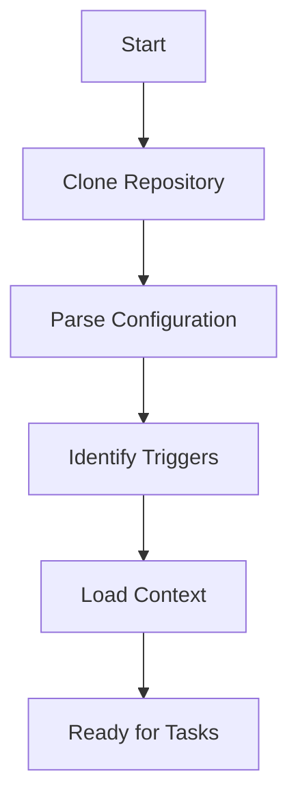
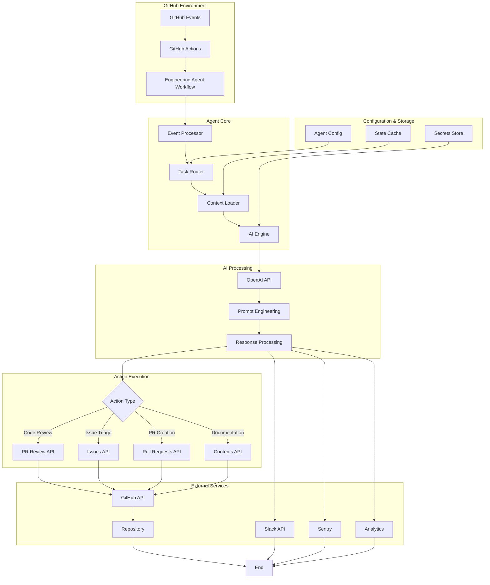

# Engineering Agent Setup Documentation

## Overview

The Engineering Agent is an AI-powered automation system that streamlines development workflows by automatically handling common engineering tasks. This intelligent agent can create pull requests, review code, manage issues, and perform repository maintenance tasks based on configurable triggers and conditions.

### Key Features

- **Automated Pull Request Creation**: Generate PRs with AI-powered code suggestions
- **Code Review Automation**: Intelligent code review with best practice recommendations
- **Issue Management**: Automatic labeling, assignment, and triage of issues
- **Documentation Generation**: Keep documentation in sync with code changes
- **CI/CD Integration**: Seamless integration with GitHub Actions workflows
- **Customizable Workflows**: Flexible configuration to match your team's processes

### Benefits

- **Increased Productivity**: Automate repetitive tasks and focus on complex problems
- **Consistent Quality**: Enforce coding standards and best practices automatically
- **Faster Review Cycles**: Reduce time from code submission to merge
- **Better Documentation**: Keep docs up-to-date without manual effort
- **Reduced Human Error**: Automated checks catch common mistakes early

---

## Prerequisites

Before setting up the Engineering Agent, ensure you have the following:

### Required

1. **GitHub Repository**: A GitHub repository with admin access
2. **GitHub Actions Enabled**: Actions must be enabled in repository settings
3. **Node.js Environment**: Node.js 18.x or higher (for local development/testing)
4. **GitHub Personal Access Token (PAT)**: Classic or fine-grained token with appropriate permissions
5. **Repository Secrets Access**: Ability to add/manage repository secrets

### Recommended

1. **Branch Protection Rules**: Configure branch protection for main/production branches
2. **Code Owners File**: Define code ownership for automated reviewer assignments
3. **Issue/PR Templates**: Templates for consistent issue and PR formatting
4. **Status Checks**: Required status checks for PR merges
5. **Semantic Versioning**: Follow semantic versioning for release management

### Permissions Required

The GitHub token must have the following permissions:

- `repo`: Full control of private repositories
- `workflow`: Update GitHub Action workflows
- `write:packages`: Upload packages to GitHub Package Registry
- `read:org`: Read org and team membership
- `admin:repo_hook`: Admin repository hooks

---

## Required GitHub Secrets

Configure the following secrets in your repository settings (`Settings` > `Secrets and variables` > `Actions`):

| Secret Name | Description | Required | Example Value | How to Obtain |
|------------|-------------|----------|---------------|---------------|
| `GITHUB_TOKEN` | GitHub Personal Access Token | ✅ Yes | `ghp_xxxxxxxxxxxx` | [Generate PAT](https://github.com/settings/tokens) |
| `OPENAI_API_KEY` | OpenAI API key for AI features | ✅ Yes | `sk-xxxxxxxxxxxx` | [OpenAI Dashboard](https://platform.openai.com/api-keys) |
| `SLACK_WEBHOOK_URL` | Slack webhook for notifications | ❌ No | `https://hooks.slack.com/services/xxx` | [Slack Incoming Webhooks](https://api.slack.com/messaging/webhooks) |
| `SENTRY_DSN` | Sentry DSN for error tracking | ❌ No | `https://xxx@sentry.io/xxx` | [Sentry Project Settings](https://sentry.io/) |
| `CODECOV_TOKEN` | Codecov token for coverage reports | ❌ No | `xxxxxxxx-xxxx-xxxx` | [Codecov Settings](https://codecov.io/) |
| `NPM_TOKEN` | NPM auth token for package publishing | ❌ No | `npm_xxxxxxxxxxxx` | [NPM Access Tokens](https://www.npmjs.com/settings/~/tokens) |
| `AGENT_CONFIG` | JSON configuration for agent behavior | ❌ No | `{"model":"gpt-4","temp":0.7}` | Create custom JSON config |

### Secret Configuration Steps

1. Navigate to your repository on GitHub
2. Click `Settings` > `Secrets and variables` > `Actions`
3. Click `New repository secret`
4. Enter the secret name and value
5. Click `Add secret`

### Security Best Practices

- **Rotate tokens regularly**: Update PATs and API keys every 90 days
- **Use fine-grained tokens**: Limit permissions to minimum required scope
- **Monitor secret usage**: Review audit logs for unexpected access
- **Store secrets securely**: Never commit secrets to version control
- **Use environment-specific secrets**: Separate secrets for dev/staging/prod

---

## Usage Methods

The Engineering Agent can be triggered in three ways:

1. **Labeling an issue** with the `agent:implement` label
2. **Assigning an issue** to `@github-actions[bot]` or `@yairbederman`
3. **Commenting on an issue** with `/engineering-agent`

### Method 1: Trigger by Labeling Issues

Add the `agent:implement` label to any issue to trigger the Engineering Agent. This is useful for explicitly marking issues that should be handled by the agent.

**Example:**
1. Create or open an issue
2. Add the label `agent:implement`
3. The agent will automatically start working on the issue

### Method 2: Trigger by Assigning Issues

Assign an issue to `@github-actions[bot]` or `@yairbederman` to trigger the Engineering Agent. This provides a natural way to delegate work to the agent.

**Example:**
1. Create or open an issue
2. Click on "Assignees" in the right sidebar
3. Select `github-actions[bot]` or `yairbederman`
4. The agent will automatically start working on the issue

**Benefits of Assignment Trigger:**
- More intuitive workflow for delegating tasks
- Visible in issue tracking and project boards
- Clear indication of who/what is working on the issue
- Works alongside existing team assignment practices

### Method 3: Trigger by Commenting

Comment on any issue with `/engineering-agent` to trigger the agent. This is useful for re-triggering the agent or providing additional instructions.

**Example:**
1. Open an issue
2. Add a comment with `/engineering-agent`
3. The agent will process the issue

### Method 4: GitHub Actions Workflow (Advanced)

Create a workflow file at `.github/workflows/engineering-agent.yml`:

```yaml
name: Engineering Agent

on:
  issues:
    types: [labeled, assigned]
  issue_comment:
    types: [created]

jobs:
  agent:
    if: |
      (github.event_name == 'issues' && github.event.label.name == 'agent:implement') ||
      (github.event_name == 'issues' && github.event.action == 'assigned' && 
       (github.event.assignee.login == 'github-actions[bot]' || 
        github.event.assignee.login == 'yairbederman')) ||
      (github.event_name == 'issue_comment' && contains(github.event.comment.body, '/engineering-agent'))
    
    runs-on: ubuntu-latest
    permissions:
      contents: write
      pull-requests: write
      issues: write
    
    steps:
      - name: Checkout repository
        uses: actions/checkout@v4
      
      - name: Setup Node.js
        uses: actions/setup-node@v4
        with:
          node-version: '18'
      
      - name: Run Engineering Agent
        uses: yairbederman/engineering-agent-action@v1
        with:
          github-token: ${{ secrets.GITHUB_TOKEN }}
          openai-api-key: ${{ secrets.OPENAI_API_KEY }}
          config-path: '.github/agent-config.yml'
```

### Method 5: Manual Trigger via Workflow Dispatch

Manually trigger the agent from the Actions tab:

1. Navigate to `Actions` tab in your repository
2. Select `Engineering Agent` workflow
3. Click `Run workflow`
4. Select branch and configure parameters
5. Click `Run workflow` button

### Method 6: CLI Tool (Local Development)

Install and run the agent locally:

```bash
# Install the CLI tool
npm install -g @yairbederman/engineering-agent

# Configure environment variables
export GITHUB_TOKEN="your_token"
export OPENAI_API_KEY="your_key"

# Run the agent
engineering-agent run --repo yairbederman/yair-test --task "review-prs"

# Run specific tasks
engineering-agent review --pr 123
engineering-agent create-pr --from feature --to main --title "New feature"
engineering-agent triage-issues --label "needs-triage"
```

### Method 7: API Integration

Integrate the agent via REST API:

```javascript
const axios = require('axios');

const triggerAgent = async () => {
  const response = await axios.post(
    'https://api.github.com/repos/yairbederman/yair-test/actions/workflows/engineering-agent.yml/dispatches',
    {
      ref: 'main',
      inputs: {
        task: 'review-prs',
        config: 'auto'
      }
    },
    {
      headers: {
        'Authorization': `token ${process.env.GITHUB_TOKEN}`,
        'Accept': 'application/vnd.github.v3+json'
      }
    }
  );
  
  console.log('Agent triggered:', response.status);
};

triggerAgent();
```

---

## Workflow Steps

### Step 1: Repository Analysis

The agent begins by analyzing the repository structure and configuration:



**Activities:**
- Clone repository and checkout relevant branch
- Parse `.github/agent-config.yml` configuration file
- Identify active triggers (PR opened, issue labeled, etc.)
- Load historical context and previous agent actions
- Initialize AI model and prepare for task execution

### Step 2: Task Identification

Determine which tasks to execute based on triggers and configuration:

**Trigger-based Tasks:**
- `pull_request.opened` → Code review and analysis
- `issues.labeled` → Issue triage and categorization
- `schedule` → Maintenance tasks and cleanup
- `issue_comment` → Respond to specific commands

**Configuration-based Tasks:**
- Check enabled features in config file
- Evaluate conditional rules and filters
- Prioritize tasks based on urgency scores

### Step 3: AI Analysis

Execute AI-powered analysis for the identified tasks:

**Code Review:**
```
1. Analyze changed files and diff
2. Check for code quality issues
3. Identify security vulnerabilities
4. Suggest performance improvements
5. Verify test coverage
6. Check documentation completeness
```

**Issue Triage:**
```
1. Parse issue content and context
2. Classify issue type (bug, feature, question)
3. Assess priority and severity
4. Recommend labels and milestones
5. Suggest assignees based on code ownership
```

### Step 4: Action Execution

Execute the determined actions via GitHub API:

**Possible Actions:**
- Create or update pull requests
- Add review comments and suggestions
- Apply labels to issues/PRs
- Assign issues to team members
- Update project boards
- Create follow-up issues
- Merge approved PRs
- Close stale issues

### Step 5: Notification & Reporting

Send notifications and generate reports:

**Notification Channels:**
- GitHub notifications (default)
- Slack messages (if webhook configured)
- Email summaries (if configured)
- Dashboard updates

**Reports Generated:**
- Action summary (markdown format)
- Error logs (if any failures)
- Performance metrics
- AI confidence scores

---

## Architecture Diagram



### Component Descriptions

**Event Processor**: Receives and normalizes GitHub webhook events

**Task Router**: Determines which tasks to execute based on event type and configuration

**Context Loader**: Fetches relevant repository context (files, history, contributors)

**AI Engine**: Interfaces with OpenAI API for intelligent analysis and suggestions

**Action Execution**: Executes determined actions via GitHub REST/GraphQL APIs

**Configuration Store**: Manages agent configuration and behavioral rules

**State Cache**: Maintains state between workflow runs for context awareness

---

## Troubleshooting

### Common Issues and Solutions

#### Issue: Agent Workflow Not Triggering

**Symptoms:**
- Workflow doesn't run on expected events
- No entries in Actions tab

**Solutions:**
1. Verify workflow file location: `.github/workflows/engineering-agent.yml`
2. Check workflow syntax using GitHub's workflow validator
3. Ensure Actions are enabled: `Settings` > `Actions` > `General`
4. Verify branch protection rules aren't blocking the workflow
5. Check event triggers match your use case

```bash
# Validate workflow syntax locally
npm install -g @github/workflow-validator
workflow-validator .github/workflows/engineering-agent.yml
```

#### Issue: Authentication Failures

**Symptoms:**
- `401 Unauthorized` errors
- `403 Forbidden` responses
- "Bad credentials" messages

**Solutions:**
1. Verify `GITHUB_TOKEN` secret is set correctly
2. Check token hasn't expired
3. Ensure token has required permissions
4. For fine-grained tokens, verify resource access
5. Check organization SSO requirements

```bash
# Test token validity
curl -H "Authorization: token $GITHUB_TOKEN" \
  https://api.github.com/user
```

#### Issue: AI API Rate Limits

**Symptoms:**
- `429 Too Many Requests` errors
- Slow response times
- Timeout errors

**Solutions:**
1. Implement request throttling in configuration
2. Increase timeout values
3. Upgrade OpenAI API plan
4. Cache AI responses for similar queries
5. Reduce analysis frequency

**Configuration Example:**
```yaml
ai:
  rate_limit:
    requests_per_minute: 10
    retry_attempts: 3
    backoff_multiplier: 2
  timeout_seconds: 30
```

#### Issue: Insufficient Permissions

**Symptoms:**
- Cannot create PRs or comments
- Cannot modify issues or labels
- "Resource not accessible" errors

**Solutions:**
1. Update workflow permissions in YAML:
```yaml
permissions:
  contents: write
  pull-requests: write
  issues: write
  discussions: write
```
2. Check repository settings allow Actions to create PRs
3. Verify token scope includes required permissions
4. For organization repos, check organization-level permissions

#### Issue: Configuration Not Loading

**Symptoms:**
- Agent uses default settings
- Custom rules not applied
- Configuration errors in logs

**Solutions:**
1. Verify config file path: `.github/agent-config.yml`
2. Validate YAML syntax
3. Check file is committed to repository
4. Ensure config is on the correct branch
5. Review config schema documentation

```bash
# Validate YAML syntax
python -c "import yaml; yaml.safe_load(open('.github/agent-config.yml'))"
```

#### Issue: Large Repository Performance

**Symptoms:**
- Workflow timeouts
- Slow analysis times
- Memory errors

**Solutions:**
1. Enable incremental analysis (only changed files)
2. Increase workflow timeout
3. Use larger GitHub-hosted runner
4. Implement file/directory exclusions
5. Enable caching for dependencies

**Configuration Example:**
```yaml
performance:
  incremental_analysis: true
  max_files_per_run: 50
  exclude_patterns:
    - "vendor/**"
    - "node_modules/**"
    - "*.min.js"
  cache:
    enabled: true
    ttl_hours: 24
```

### Debug Mode

Enable detailed logging for troubleshooting:

```yaml
- name: Run Engineering Agent
  uses: yairbederman/engineering-agent-action@v1
  with:
    github-token: ${{ secrets.GITHUB_TOKEN }}
    openai-api-key: ${{ secrets.OPENAI_API_KEY }}
    debug: true
    log-level: verbose
```

### Getting Help

If issues persist:

1. **Check Documentation**: Review the [Wiki](https://github.com/yairbederman/yair-test/wiki)
2. **Search Issues**: Look for similar problems in [Issues](https://github.com/yairbederman/yair-test/issues)
3. **Enable Debug Logs**: Share verbose logs when reporting issues
4. **Community Support**: Ask in [Discussions](https://github.com/yairbederman/yair-test/discussions)
5. **File Bug Report**: Create detailed issue with reproduction steps

---

## Best Practices

### 1. Configuration Management

**Use Version-Controlled Configuration:**
```yaml
# .github/agent-config.yml
version: "1.0"
agent:
  name: "Engineering Agent"
  enabled: true
  
features:
  code_review:
    enabled: true
    auto_approve: false
    min_confidence: 0.85
  
  issue_triage:
    enabled: true
    auto_label: true
    auto_assign: true
  
  documentation:
    enabled: true
    auto_update: true
    formats: ["markdown", "jsdoc"]
```

**Environment-Specific Configs:**
- Maintain separate configs for dev, staging, production
- Use GitHub Environments for secret management
- Test configuration changes in feature branches first

### 2. Security & Compliance

**Token Security:**
- Use fine-grained tokens with minimal scope
- Rotate tokens every 60-90 days
- Monitor token usage in audit logs
- Never log or expose tokens in workflow output

**Code Review Standards:**
- Require human approval for agent-created PRs
- Enable branch protection for critical branches
- Maintain audit trail of agent actions
- Regular security audits of agent permissions

**Data Privacy:**
- Avoid sending sensitive data to external APIs
- Configure data retention policies
- Implement PII detection and filtering
- Review AI provider's data usage policies

### 3. Performance Optimization

**Workflow Optimization:**
```yaml
# Use job concurrency to prevent conflicts
concurrency:
  group: engineering-agent-${{ github.ref }}
  cancel-in-progress: true

# Cache dependencies
- name: Cache node modules
  uses: actions/cache@v3
  with:
    path: ~/.npm
    key: ${{ runner.os }}-node-${{ hashFiles('**/package-lock.json') }}
```

**Resource Management:**
- Set appropriate timeouts for each task
- Implement circuit breakers for external APIs
- Use incremental processing for large codebases
- Monitor and optimize API usage

### 4. Testing & Validation

**Pre-Deployment Testing:**
```bash
# Test configuration
npm run validate-config

# Test workflow locally with act
act -j agent -s GITHUB_TOKEN=xxx

# Dry-run mode
engineering-agent run --dry-run --repo yairbederman/yair-test
```

**Continuous Monitoring:**
- Set up alerts for workflow failures
- Monitor AI confidence scores
- Track action success/failure rates
- Review agent-generated changes regularly

### 5. Team Collaboration

**Documentation:**
- Maintain up-to-date runbooks
- Document custom workflows and triggers
- Create onboarding guides for new team members
- Share agent insights in team meetings

**Communication:**
- Configure Slack notifications for important events
- Create dashboard for agent metrics
- Regular review of agent effectiveness
- Gather team feedback for improvements

**Governance:**
- Establish clear ownership of agent configuration
- Define escalation procedures for issues
- Regular reviews of agent decisions
- Continuous improvement based on metrics

### 6. Maintenance Schedule

**Daily:**
- Review agent actions and outcomes
- Check for workflow failures
- Monitor API usage and costs

**Weekly:**
- Analyze performance metrics
- Review and update configuration
- Clean up stale branches/issues
- Update documentation as needed

**Monthly:**
- Security audit and token rotation
- Review and optimize AI prompts
- Evaluate new features and updates
- Team retrospective on agent effectiveness

**Quarterly:**
- Comprehensive agent performance review
- Cost-benefit analysis
- Major configuration updates
- Training updates for team members

### 7. Gradual Rollout Strategy

**Phase 1: Observation (Week 1-2)**
- Enable read-only mode
- Agent analyzes but doesn't take action
- Review suggestions manually
- Fine-tune configuration

**Phase 2: Limited Automation (Week 3-4)**
- Enable specific features (e.g., labeling only)
- Require human approval for all changes
- Monitor accuracy and usefulness
- Adjust confidence thresholds

**Phase 3: Expanded Automation (Month 2)**
- Enable additional features gradually
- Reduce human approval requirements
- Increase automation scope
- Continue monitoring closely

**Phase 4: Full Automation (Month 3+)**
- Enable all desired features
- Maintain oversight and monitoring
- Continuous optimization
- Regular review cycles

---

## Additional Resources

### Documentation Links

- [GitHub Actions Documentation](https://docs.github.com/en/actions)
- [GitHub REST API Reference](https://docs.github.com/en/rest)
- [OpenAI API Documentation](https://platform.openai.com/docs)
- [YAML Syntax Guide](https://yaml.org/spec/1.2/spec.html)

### Example Repositories

- [Example Configuration Templates](https://github.com/yairbederman/yair-test/tree/main/.github/examples)
- [Sample Workflows](https://github.com/yairbederman/yair-test/tree/main/.github/workflows)
- [Community Configurations](https://github.com/topics/engineering-agent)

### Support Channels

- **GitHub Issues**: [Report bugs and request features](https://github.com/yairbederman/yair-test/issues)
- **Discussions**: [Community Q&A](https://github.com/yairbederman/yair-test/discussions)
- **Documentation**: [Full documentation site](https://yairbederman.github.io/yair-test)
- **Email**: support@example.com

---

## Version History

| Version | Date | Changes |
|---------|------|---------|
| 1.0.0 | 2025-12-29 | Initial release of Engineering Agent documentation |

---

## License

This documentation is part of the yair-test repository and is subject to the repository's license terms.

---

**Last Updated**: 2025-12-29 16:52:01 UTC  
**Maintained By**: yairbederman  
**Status**: Active
